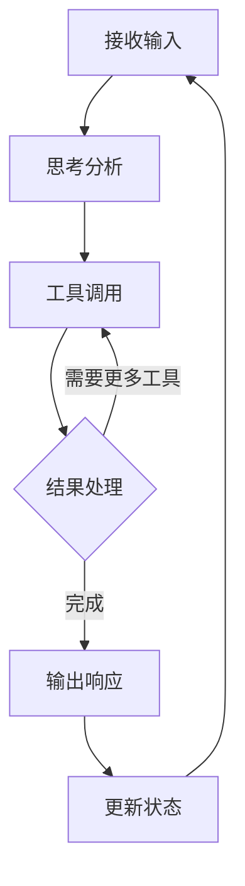

# 代理运行时

代理是 OpenClaw 的核心执行单元，负责处理用户请求、调用工具、管理会话状态和执行自动化任务。代理运行时环境提供了代理执行所需的所有基础设施，确保安全、高效和可靠的操作。

## 概述

### 什么是代理？

在 OpenClaw 中，**代理**是一个智能执行实体，能够：

- 理解自然语言请求
- 规划任务执行步骤
- 调用适当的工具完成任务
- 管理对话上下文和状态
- 从历史交互中学习和改进

代理运行在专门的运行时环境中，该环境提供了资源管理、安全沙箱、工具调用和状态持久化等核心功能。

## 核心特性

### 1. 工具调用能力

代理可以调用多种工具来扩展其能力边界：

- **浏览器工具**：网页浏览、内容提取、表单填写、自动化测试
- **执行工具**：在受控环境中运行 shell 命令和脚本
- **消息工具**：跨平台消息发送、接收和管理
- **节点工具**：访问设备功能（摄像头、屏幕录制、地理位置等）
- **文件工具**：读写文件、编辑内容、管理文档
- **网络工具**：HTTP 请求、API 调用、数据获取

### 2. 会话管理

每个代理都在特定的**会话**上下文中运行，会话提供了：

- **对话历史**：完整的交互记录
- **工具调用记录**：执行的工具和结果
- **用户偏好设置**：个性化配置和偏好
- **执行状态**：当前任务进度和状态
- **上下文保持**：长期对话连贯性

### 3. 记忆系统

代理通过**记忆**系统维护长期上下文：

- **短期记忆**：当前会话的上下文和临时信息
- **长期记忆**：跨会话的知识保留和持久化存储
- **记忆压缩**：自动优化记忆存储，平衡性能和完整性
- **向量搜索**：语义搜索历史记忆和笔记

### 4. 安全沙箱

代理在受控的沙箱环境中运行，确保系统安全：

- **资源限制**：CPU、内存、网络使用限制
- **权限控制**：基于角色的工具访问权限
- **执行监控**：实时监控代理行为和安全检查
- **隔离环境**：与主机系统隔离，防止意外影响
- **审计日志**：详细的操作日志和安全审计

## 代理执行循环

代理遵循典型的思考-执行循环，确保系统化的任务处理：



### 详细步骤

1. **接收输入**：
   - 从用户或系统接收自然语言请求
   - 解析请求意图和上下文
   - 加载相关历史会话和记忆

2. **思考分析**：
   - 分析请求，识别核心需求
   - 规划执行步骤和工具选择
   - 评估风险和可行性
   - 确定优先级和执行顺序

3. **工具调用**：
   - 选择适当的工具
   - 准备工具参数和上下文
   - 在安全沙箱中执行工具
   - 监控工具执行和资源使用

4. **结果处理**：
   - 解析工具返回结果
   - 评估执行效果
   - 决定是否需要进一步操作
   - 整合多个工具的结果

5. **输出响应**：
   - 生成自然语言响应
   - 格式化输出内容
   - 包含执行摘要和下一步建议
   - 更新会话状态和记忆

## 多代理协作

OpenClaw 支持**多代理**系统，实现复杂任务的分布式处理：

### 协作模式

- **并行执行**：多个代理同时处理不同任务，提高效率
- **协作工作流**：代理之间传递任务和结果，形成处理流水线
- **专业分工**：不同专业领域的代理协同工作，发挥各自优势
- **层级管理**：主代理协调子代理，实现复杂任务分解

### 路由机制

- **智能路由**：根据任务类型和代理能力路由请求
- **负载均衡**：平衡各代理的工作负载
- **故障转移**：自动切换到备用代理
- **优先级调度**：根据任务紧急程度调整执行顺序

## 配置与扩展

### 系统提示配置

通过**系统提示**定义代理的行为准则和特性：

```json
{
  "agent": {
    "systemPrompt": "你是一个专业的软件开发助手，专注于代码编写、调试和技术咨询。保持回答专业、准确、有帮助。"
  }
}
```

### 工具注册和配置

开发人员可以注册自定义工具，扩展代理的能力：

```json
{
  "tools": {
    "customTool": {
      "description": "自定义工具描述",
      "parameters": {
        "param1": {
          "type": "string",
          "description": "参数描述"
        }
      },
      "handler": "path/to/handler.js"
    }
  }
}
```

### 运行时参数调整

调整代理的行为和性能参数：

```json
{
  "agent": {
    "parameters": {
      "temperature": 0.7,
      "maxTokens": 2000,
      "thinkingDepth": "deep",
      "creativity": "balanced"
    }
  }
}
```

### 沙箱配置

配置代理的安全沙箱环境：

```json
{
  "agent": {
    "sandbox": {
      "enabled": true,
      "resourceLimits": {
        "cpu": "50%",
        "memory": "1GB",
        "disk": "10GB",
        "network": "restricted"
      },
      "toolPermissions": {
        "exec": true,
        "browser": true,
        "write": "workspace-only",
        "read": "full"
      }
    }
  }
}
```

## 使用场景

### 场景 1：个人助理

- **日常任务**：日程管理、提醒设置、信息查询
- **通信处理**：邮件整理、消息回复、会议安排
- **知识管理**：笔记整理、文档摘要、学习辅助

### 场景 2：开发助手

- **代码编写**：代码生成、调试帮助、代码审查
- **技术咨询**：技术方案、架构设计、最佳实践
- **自动化测试**：测试脚本、性能分析、质量检查

### 场景 3：客服支持

- **自动应答**：常见问题解答、问题分类
- **工单处理**：问题记录、状态跟踪、升级处理
- **客户反馈**：情感分析、满意度评估、改进建议

### 场景 4：数据分析

- **数据获取**：从多个来源收集数据
- **数据处理**：清洗、转换、分析数据
- **报告生成**：可视化、摘要、洞察发现

## 性能优化

### 响应时间优化

1. **缓存策略**：缓存频繁访问的数据和计算结果
2. **预加载机制**：预加载可能需要的工具和资源
3. **并行处理**：同时处理多个子任务
4. **懒加载**：按需加载工具和资源

### 资源管理

1. **内存优化**：及时释放不再使用的资源
2. **连接池**：重用数据库和网络连接
3. **压缩传输**：压缩网络传输数据
4. **批量操作**：合并小操作提高效率

### 监控和调优

1. **性能指标**：响应时间、成功率、资源使用率
2. **错误分析**：错误类型、频率、影响范围
3. **使用模式**：高峰时段、常用功能、用户行为
4. **容量规划**：根据增长预测规划资源

## 故障排除

### 常见问题

#### 代理无响应
- **检查网络连接**：确保网关和代理通信正常
- **查看日志文件**：检查错误和警告信息
- **验证配置**：确认代理配置正确
- **重启服务**：尝试重启代理或网关

#### 工具调用失败
- **检查权限**：验证工具访问权限
- **查看参数**：确认工具参数格式正确
- **测试工具**：单独测试工具功能
- **检查资源**：确保有足够资源运行工具

#### 记忆丢失
- **检查存储**：验证记忆文件存储位置
- **查看权限**：确认有写入权限
- **检查配置**：验证记忆系统配置
- **手动备份**：定期备份重要记忆

### 调试工具

```bash
# 查看代理状态
openclaw agent status

# 检查代理日志
openclaw logs --agent <agentId>

# 测试工具调用
openclaw tool test <toolName> --params '{"param": "value"}'

# 监控代理性能
openclaw monitor --agent <agentId>

# 重置代理状态
openclaw agent reset <agentId>
```

## 最佳实践

### 设计原则

1. **明确职责**：为每个代理定义清晰的职责范围
2. **适度能力**：避免赋予代理过多或过少的能力
3. **安全优先**：始终在安全沙箱中运行不可信代理
4. **可观测性**：设计可监控和调试的代理系统

### 配置管理

1. **版本控制**：将代理配置纳入版本控制系统
2. **环境分离**：区分开发、测试和生产环境配置
3. **参数化配置**：使用环境变量和配置文件
4. **定期审查**：定期审查和更新配置

### 运维管理

1. **健康检查**：定期检查代理健康状况
2. **容量规划**：根据使用趋势规划资源
3. **备份策略**：定期备份配置和状态
4. **更新策略**：制定代理和工具更新计划

### 安全实践

1. **最小权限**：仅授予必要的最小权限
2. **输入验证**：严格验证所有输入数据
3. **输出过滤**：过滤敏感信息输出
4. **审计日志**：记录所有重要操作

---

*本文档已根据 OpenClaw 技术术语表进行专业重译和扩展，确保术语一致性和内容完整性。有关最新信息，请参考相关技术文档。*