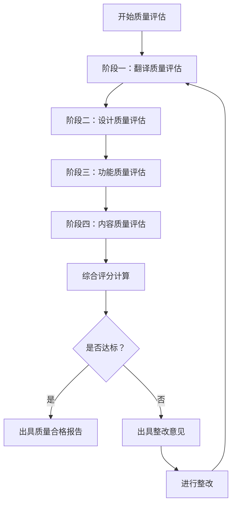

# OpenClaw中文文档网站质量评估标准和验收流程

## 1. 质量评估框架

### 1.1 质量维度
| 维度 | 权重 | 描述 |
|------|------|------|
| **翻译质量** | 40% | 翻译准确性、术语一致性、可读性 |
| **设计质量** | 25% | 视觉设计、用户体验、响应式适配 |
| **功能质量** | 20% | 功能完整性、性能、稳定性 |
| **内容质量** | 15% | 内容完整性、时效性、SEO优化 |

### 1.2 总体质量等级
| 等级 | 综合得分 | 描述 |
|------|----------|------|
| **优秀 (A)** | 90-100分 | 超出预期，达到专业出版水平 |
| **良好 (B)** | 80-89分 | 符合预期，满足所有要求 |
| **合格 (C)** | 70-79分 | 基本合格，有改进空间 |
| **不合格 (D)** | <70分 | 未达到要求，需要返工 |

**项目目标**：达到**良好 (B)** 以上等级，力争**优秀 (A)**

## 2. 翻译质量标准

### 2.1 翻译准确性（权重：15%）
| 指标 | 评分标准 | 满分 | 评估方法 |
|------|----------|------|----------|
| **语义准确性** | 准确传达原文意思，无歧义 | 5分 | 抽样检查，对比原文 |
| **技术准确性** | 技术描述准确无误 | 5分 | 技术专家审核 |
| **文化适应性** | 符合中文表达习惯 | 5分 | 母语者阅读体验 |

**评估方法**：
- 随机抽取10%的文档进行原文-译文对比
- 技术文档部分由技术专家重点审核
- 记录发现的错误数量和严重程度

**合格标准**：错误率<5%（每1000字错误≤5处）

### 2.2 术语一致性（权重：15%）
| 指标 | 评分标准 | 满分 | 评估方法 |
|------|----------|------|----------|
| **核心术语一致** | 关键技术术语全文一致 | 8分 | 术语表检查工具 |
| **品牌术语处理** | 品牌名称、产品名正确处理 | 4分 | 人工检查 |
| **缩写一致性** | 缩写使用和处理一致 | 3分 | 正则表达式检查 |

**评估方法**：
- 使用术语一致性检查工具扫描所有文档
- 检查术语表覆盖率和遵循率
- 验证品牌术语处理规范

**合格标准**：术语一致性100%

### 2.3 可读性（权重：10%）
| 指标 | 评分标准 | 满分 | 评估方法 |
|------|----------|------|----------|
| **语言流畅度** | 语句通顺，符合中文语法 | 4分 | 可读性评分工具 |
| **表达清晰度** | 表达清晰，易于理解 | 3分 | 理解测试 |
| **格式规范性** | 标点、空格、格式规范 | 3分 | 格式检查工具 |

**评估方法**：
- 使用中文可读性分析工具
- 邀请非技术人员进行理解测试
- 检查格式规范符合度

**合格标准**：可读性评分≥70分（满分100）

## 3. 设计质量标准

### 3.1 视觉设计（权重：10%）
| 指标 | 评分标准 | 满分 | 评估方法 |
|------|----------|------|----------|
| **品牌一致性** | 符合OpenClaw品牌规范 | 3分 | 品牌指南对比 |
| **视觉层次** | 信息层次清晰，重点突出 | 3分 | 视觉层次分析 |
| **美学质量** | 美观大方，专业感强 | 4分 | 设计专家评审 |

**评估方法**：
- 对比OpenClaw英文网站设计风格
- 检查颜色、字体、间距等设计元素
- 设计专家进行专业评审

**合格标准**：达到或接近原始英文网站设计水平

### 3.2 用户体验（权重：10%）
| 指标 | 评分标准 | 满分 | 评估方法 |
|------|----------|------|----------|
| **导航易用性** | 导航清晰，易于找到内容 | 4分 | 用户任务测试 |
| **阅读舒适度** | 排版舒适，阅读不疲劳 | 3分 | 眼动追踪（如有） |
| **操作直观性** | 交互操作直观易理解 | 3分 | 首次使用测试 |

**评估方法**：
- 用户任务完成测试（5个典型任务）
- 阅读舒适度主观评价
- 新用户首次使用观察

**合格标准**：任务完成率≥90%，用户满意度≥4分（5分制）

### 3.3 响应式适配（权重：5%）
| 设备类型 | 评分标准 | 满分 | 评估方法 |
|----------|----------|------|----------|
| **桌面端** | 大屏幕显示良好 | 1分 | 多种分辨率测试 |
| **平板端** | 中等屏幕适配良好 | 2分 | 平板设备测试 |
| **手机端** | 小屏幕体验优秀 | 2分 | 手机设备测试 |

**评估方法**：
- 使用Chrome DevTools设备模拟
- 实际设备测试（至少3种不同尺寸）
- 检查布局是否正常，功能是否可用

**合格标准**：在所有测试设备上功能正常，布局合理

## 4. 功能质量标准

### 4.1 功能完整性（权重：8%）
| 功能模块 | 评分标准 | 满分 | 评估方法 |
|----------|----------|------|----------|
| **搜索功能** | 全文搜索快速准确 | 2分 | 搜索测试用例 |
| **导航功能** | 多级导航正常工作 | 2分 | 导航链接测试 |
| **语言切换** | 中英文切换流畅 | 2分 | 语言切换测试 |
| **代码高亮** | 代码显示和复制功能 | 2分 | 多种代码测试 |

**评估方法**：
- 编写测试用例并执行
- 检查所有交互功能
- 验证边界情况和异常处理

**合格标准**：所有设计功能100%正常工作

### 4.2 性能指标（权重：7%）
| 性能指标 | 评分标准 | 满分 | 评估方法 |
|----------|----------|------|----------|
| **加载速度** | 页面加载时间<2秒 | 3分 | Lighthouse测试 |
| **资源优化** | 图片、CSS、JS优化 | 2分 | 网络面板分析 |
| **首次输入延迟** | FID<100ms | 2分 | Web Vitals测试 |

**评估方法**：
- Google Lighthouse性能测试
- WebPageTest多地点测试
- Chrome DevTools性能分析

**合格标准**：Lighthouse性能评分≥90，核心Web Vitals达标

### 4.3 稳定性（权重：5%）
| 稳定性指标 | 评分标准 | 满分 | 评估方法 |
|------------|----------|------|----------|
| **链接有效性** | 无死链、错链 | 3分 | 链接检查工具 |
| **跨浏览器兼容** | 主流浏览器正常 | 2分 | 多浏览器测试 |

**评估方法**：
- 使用链接检查工具扫描全站
- 在Chrome、Firefox、Safari、Edge测试
- 检查JavaScript错误控制台

**合格标准**：无404错误，主流浏览器兼容性100%

## 5. 内容质量标准

### 5.1 内容完整性（权重：8%）
| 完整性指标 | 评分标准 | 满分 | 评估方法 |
|------------|----------|------|----------|
| **文档覆盖率** | 100%覆盖原始文档 | 4分 | 文件对比检查 |
| **无占位符** | 无未翻译的占位符 | 2分 | 内容扫描 |
| **图片完整性** | 图片正常显示，alt文本完整 | 2分 | 图片检查 |

**评估方法**：
- 对比原始英文文档目录结构
- 检查所有页面内容完整性
- 验证多媒体资源可用性

**合格标准**：100%覆盖原始文档，无缺失内容

### 5.2 SEO优化（权重：4%）
| SEO指标 | 评分标准 | 满分 | 评估方法 |
|----------|----------|------|----------|
| **元数据完整** | 标题、描述、关键词完整 | 2分 | 元数据检查 |
| **语义化结构** | 合理的HTML结构 | 1分 | HTML验证 |
| **移动友好性** | 移动端SEO优化 | 1分 | 移动友好测试 |

**评估方法**：
- Google Search Console测试
- SEO检查工具扫描
- 移动友好性测试工具

**合格标准**：基础SEO元素完整，移动友好通过

### 5.3 时效性（权重：3%）
| 时效性指标 | 评分标准 | 满分 | 评估方法 |
|------------|----------|------|----------|
| **更新日期** | 显示最后更新日期 | 1分 | 页面检查 |
| **内容新鲜度** | 与英文文档同步程度 | 2分 | 版本对比 |

**评估方法**：
- 检查页面是否显示更新日期
- 对比英文原版文档版本
- 验证新功能是否已翻译

**合格标准**：更新日期显示正确，与英文原版延迟≤1个月

## 6. 质量评估流程

### 6.1 评估阶段


### 6.2 评估方法
| 评估类型 | 实施方式 | 参与人员 | 产出物 |
|----------|----------|----------|--------|
| **自动化测试** | 工具扫描、脚本检查 | 技术开发 | 自动化测试报告 |
| **专家评审** | 专业人员人工评审 | 领域专家 | 专家评审意见 |
| **用户测试** | 目标用户实际使用测试 | 目标用户 | 用户测试报告 |
| **对比分析** | 与原始英文网站对比 | 项目经理 | 对比分析报告 |

### 6.3 抽样方案
- **翻译质量**：随机抽取30%的文档进行详细检查
- **功能测试**：100%功能点测试
- **链接检查**：全站链接扫描
- **性能测试**：首页和5个关键页面详细测试

## 7. 验收流程

### 7.1 验收阶段
#### 阶段一：内部验收（项目团队）
- **时间**：项目完成后1天内
- **参与人员**：项目经理、技术开发、翻译专员、测试专员
- **验收内容**：
  1. 所有功能按设计实现
  2. 翻译质量达到标准
  3. 性能指标符合要求
- **产出物**：内部验收报告

#### 阶段二：技术验收（技术专家）
- **时间**：内部验收通过后1天内
- **参与人员**：OpenClaw技术专家、外部技术顾问
- **验收内容**：
  1. 技术准确性验证
  2. 架构合理性评估
  3. 安全性和稳定性检查
- **产出物**：技术验收意见

#### 阶段三：用户验收（目标用户）
- **时间**：技术验收通过后2天内
- **参与人员**：5-10名目标用户
- **验收内容**：
  1. 用户体验测试
  2. 实际使用场景验证
  3. 满意度调查
- **产出物**：用户验收报告

#### 阶段四：最终验收（项目经理）
- **时间**：所有验收通过后
- **参与人员**：项目经理、利益相关者
- **验收内容**：
  1. 所有验收报告审核
  2. 项目成果综合评价
  3. 正式交付确认
- **产出物**：最终验收证书

### 7.2 验收文档
1. **内部验收报告**（模板见附件1）
2. **技术验收意见表**（模板见附件2）
3. **用户测试报告**（模板见附件3）
4. **最终验收证书**（模板见附件4）

## 8. 质量改进机制

### 8.1 持续监控
| 监控维度 | 监控指标 | 监控频率 | 负责人 |
|----------|----------|----------|--------|
| **网站可用性** | 正常运行时间 | 实时 | 技术开发 |
| **性能监控** | 页面加载时间 | 每日 | 技术开发 |
| **用户反馈** | 用户问题和建议 | 每周 | 项目经理 |
| **内容更新** | 英文文档变更 | 每月 | 翻译专员 |

### 8.2 定期评估
- **月度评估**：检查网站基本运行状态
- **季度评估**：全面质量评估（按本标准）
- **年度评估**：与最新技术标准对比评估

### 8.3 改进流程
1. **问题识别**：通过监控或用户反馈发现问题
2. **优先级评估**：根据影响程度确定优先级
3. **改进实施**：制定改进计划并实施
4. **效果验证**：验证改进效果，更新质量标准

## 9. 质量评估工具清单

### 9.1 翻译质量工具
- **术语一致性检查**：自定义脚本或现有工具
- **翻译质量评估**：BLEU、METEOR等自动化指标
- **可读性分析**：中文可读性分析工具

### 9.2 设计质量工具
- **设计对比工具**：像素对比、设计系统检查
- **响应式测试**：Chrome DevTools、BrowserStack
- **无障碍测试**：aXe、WAVE

### 9.3 功能质量工具
- **链接检查**：wget、linkchecker
- **性能测试**：Google Lighthouse、WebPageTest
- **兼容性测试**：BrowserStack、Sauce Labs

### 9.4 内容质量工具
- **SEO分析**：Google Search Console、SEMrush
- **内容完整性检查**：文件对比脚本
- **更新监测**：Git版本对比

## 10. 附件：评估模板

### 附件1：内部验收报告模板
```markdown
# 内部验收报告

## 项目信息
- 项目名称：OpenClaw中文文档网站重构
- 验收日期：YYYY-MM-DD
- 验收人员：[姓名列表]

## 验收结果
| 验收项 | 是否通过 | 备注 |
|--------|----------|------|
| 功能完整性 | □是 □否 | |
| 翻译质量 | □是 □否 | |
| 设计质量 | □是 □否 | |
| 性能指标 | □是 □否 | |

## 发现的问题
1. [问题描述]
   - 严重程度：[高/中/低]
   - 建议解决方案：[方案描述]

## 验收结论
□ 通过验收，可以进入下一阶段
□ 有条件通过，需解决指定问题
□ 不通过，需要重大修改

## 签字确认
项目经理：_________________
技术开发：_________________
翻译专员：_________________
测试专员：_________________
```

### 附件2：技术验收意见表模板
```markdown
# 技术验收意见表

## 技术准确性评估
| 技术领域 | 评估结果 | 详细意见 |
|----------|----------|----------|
| 概念描述 | □准确 □基本准确 □不准确 | |
| 配置说明 | □准确 □基本准确 □不准确 | |
| 代码示例 | □准确 □基本准确 □不准确 | |

## 架构评估
| 评估维度 | 评分（1-5分） | 说明 |
|----------|--------------|------|
| 技术架构合理性 | | |
| 可维护性 | | |
| 扩展性 | | |

## 安全性评估
- [ ] 无已知安全漏洞
- [ ] 符合安全最佳实践
- [ ] 需要安全改进

## 总体评价
[总体评价文字]

## 签字
技术专家：_________________
日期：YYYY-MM-DD
```

（其他模板略）

---
**质量评估标准制定时间**：2026-02-14 11:45 UTC  
**制定人**：文档翻译和网站重构专家  
**适用范围**：OpenClaw中文文档网站重构项目