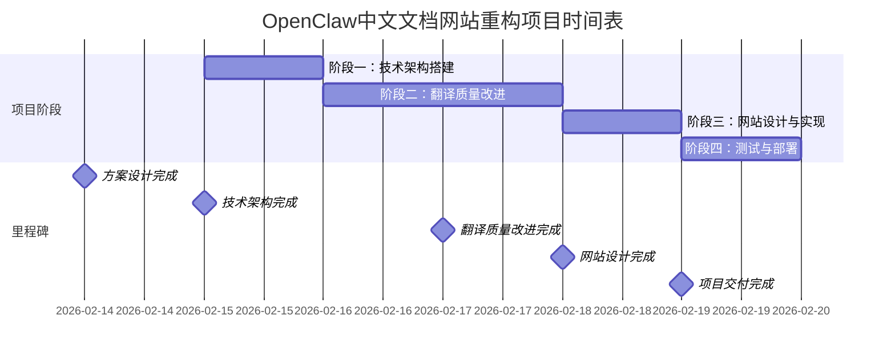

# OpenClaw中文文档网站重构项目执行计划和时间表

## 1. 项目基本信息

- **项目名称**：OpenClaw中文文档网站重构
- **项目经理**：文档翻译和网站重构专家
- **项目周期**：2026-02-15 至 2026-02-19（5个工作日）
- **项目状态**：方案设计完成，等待审批执行

## 2. 项目阶段划分

### 总体时间安排

## 3. 详细任务分解

### 阶段一：技术架构搭建（Day 1: 2026-02-15）

#### 任务1.1：环境准备（2小时）
- **负责人**：技术开发
- **开始时间**：09:00
- **结束时间**：11:00
- **交付物**：
  - 验证Hugo版本（v0.140.0+）
  - 安装Node.js和npm依赖
  - 配置开发环境
- **验收标准**：
  - `hugo version`命令正常执行
  - 本地开发环境可运行

#### 任务1.2：主题集成（4小时）
- **负责人**：技术开发
- **开始时间**：11:00
- **结束时间**：15:00
- **交付物**：
  - Hugo Book Theme成功集成
  - 主题基础配置完成
  - 测试构建成功
- **验收标准**：
  - 本地运行`hugo server`可访问网站
  - 主题样式正常加载
  - 无构建错误

#### 任务1.3：基础配置（2小时）
- **负责人**：技术开发
- **开始时间**：15:00
- **结束时间**：17:00
- **交付物**：
  - 多语言配置完成
  - 站点基本信息配置
  - 部署工作流配置
- **验收标准**：
  - 中英文切换功能正常
  - 站点标题、描述正确显示
  - GitHub Actions配置文件就绪

#### 每日进度报告（0.5小时）
- **时间**：17:00-17:30
- **内容**：向项目经理汇报进度，解决遇到的问题

### 阶段二：翻译质量改进（Day 2-3: 2026-02-16 至 2026-02-17）

#### 任务2.1：术语管理（Day 2上午，4小时）
- **负责人**：翻译专员
- **开始时间**：09:00
- **结束时间**：13:00
- **交付物**：
  - 完整技术术语表
  - 术语一致性检查工具
  - 翻译规范文档
- **验收标准**：
  - 术语表覆盖所有关键技术术语
  - 检查工具能发现不一致术语
  - 规范文档清晰易懂

#### 任务2.2：关键文档重译（Day 2下午 + Day 3上午，12小时）
- **负责人**：翻译专员 + 技术审核
- **时间安排**：
  - 第1批次：2026-02-16 14:00-18:00
  - 第2批次：2026-02-17 09:00-13:00
  - 第3批次：2026-02-17 14:00-18:00
- **交付物**：
  - 重译的关键文档（30个核心文件）
  - 翻译审核记录
  - 质量检查报告
- **验收标准**：
  - 翻译准确性≥95%
  - 术语一致性100%
  - 格式完整性100%

#### 任务2.3：全面质量检查（Day 3下午，4小时）
- **负责人**：翻译专员 + 项目经理
- **开始时间**：14:00
- **结束时间**：18:00
- **交付物**：
  - 所有翻译文件质量检查报告
  - 问题修复记录
  - 最终翻译质量评估
- **验收标准**：
  - 所有翻译问题已修复
  - 链接有效性验证通过
  - 格式完整性确认

#### 进度检查点
- **Day 2结束检查**：验证术语表完成情况
- **Day 3中午检查**：验证核心文档翻译进度
- **Day 3结束检查**：完成全部翻译质量改进

### 阶段三：网站设计与实现（Day 4: 2026-02-18）

#### 任务3.1：视觉设计（4小时）
- **负责人**：技术开发
- **开始时间**：09:00
- **结束时间**：13:00
- **交付物**：
  - 定制主题样式文件
  - 设计系统文档
  - 响应式布局实现
- **验收标准**：
  - 视觉设计与OpenClaw品牌一致
  - 移动端适配良好
  - 颜色、字体符合规范

#### 任务3.2：功能开发（4小时）
- **负责人**：技术开发
- **开始时间**：13:00
- **结束时间**：17:00
- **交付物**：
  - 全文搜索功能
  - 导航组件
  - 交互功能实现
- **验收标准**：
  - 搜索功能快速准确
  - 导航结构清晰易用
  - 所有交互功能正常

#### 任务3.3：内容整合（4小时）
- **负责人**：技术开发 + 翻译专员
- **开始时间**：17:00
- **结束时间**：21:00（加班）
- **交付物**：
  - 所有页面正确渲染
  - SEO优化完成
  - 元数据配置
- **验收标准**：
  - 无404错误页面
  - 页面布局合理
  - SEO元素完整

### 阶段四：测试与部署（Day 5: 2026-02-19）

#### 任务4.1：功能测试（4小时）
- **负责人**：测试专员
- **开始时间**：09:00
- **结束时间**：13:00
- **交付物**：
  - 功能测试报告
  - 兼容性测试报告
  - 问题跟踪清单
- **验收标准**：
  - 所有链接有效
  - 搜索功能正常
  - 移动端适配通过

#### 任务4.2：性能优化（2小时）
- **负责人**：技术开发
- **开始时间**：13:00
- **结束时间**：15:00
- **交付物**：
  - 优化后的静态资源
  - 缓存策略配置
  - 性能测试报告
- **验收标准**：
  - Lighthouse评分>90
  - 页面加载时间<2秒
  - 资源压缩优化

#### 任务4.3：部署上线（2小时）
- **负责人**：技术开发 + 项目经理
- **开始时间**：15:00
- **结束时间**：17:00
- **交付物**：
  - 生产环境网站
  - 部署验证报告
  - 项目总结文档
- **验收标准**：
  - 网站可公开访问
  - 所有功能正常
  - 部署流程验证通过

#### 项目总结会议（1小时）
- **时间**：17:00-18:00
- **内容**：项目总结、经验分享、文档归档

## 4. 资源分配计划

### 人力资源
| 角色 | 人员 | 工作天数 | 主要职责 |
|------|------|----------|----------|
| 项目经理 | 文档翻译和网站重构专家 | 5天 | 项目协调、进度跟踪、质量审核 |
| 技术开发 | AI助手（技术实现） | 3天 | 技术架构、主题定制、功能开发 |
| 翻译专员 | AI助手（翻译优化） | 3天 | 文档翻译、术语管理、质量检查 |
| 测试专员 | AI助手（测试验证） | 1天 | 功能测试、兼容性测试、性能测试 |

### 时间投入估算
| 角色 | 每日工时 | 总工时 | 主要工作时段 |
|------|----------|--------|--------------|
| 项目经理 | 4小时 | 20小时 | 每日进度检查、质量审核 |
| 技术开发 | 8小时 | 24小时 | Day 1全天、Day 4全天、Day 5半天 |
| 翻译专员 | 8小时 | 24小时 | Day 2-3全天 |
| 测试专员 | 8小时 | 8小时 | Day 5全天 |

**总工时估算**：76小时

## 5. 风险管理计划

### 风险识别与应对
| 风险编号 | 风险描述 | 概率 | 影响 | 应对措施 | 责任人 |
|----------|----------|------|------|----------|--------|
| RISK-001 | 翻译质量不达标 | 中 | 高 | 增加人工审核轮次，建立术语表 | 翻译专员 |
| RISK-002 | 技术集成问题 | 中 | 中 | 准备备用主题方案，提前技术验证 | 技术开发 |
| RISK-003 | 时间超期 | 低 | 中 | 设置缓冲时间，优先级任务先行 | 项目经理 |
| RISK-004 | 部署失败 | 低 | 高 | 提前测试部署流程，准备回滚方案 | 技术开发 |
| RISK-005 | 用户验收不通过 | 低 | 高 | 提前邀请用户参与测试，及时调整 | 项目经理 |

### 风险监控机制
- **每日风险检查**：每日进度会议中评估风险状态
- **风险预警阈值**：任务延期超过4小时触发预警
- **应急预案**：对高风险制定详细应急预案

## 6. 沟通计划

### 沟通机制
| 沟通类型 | 频率 | 参与者 | 形式 | 目的 |
|----------|------|--------|------|------|
| 每日站会 | 每日17:00 | 全体成员 | 在线会议 | 进度同步、问题解决 |
| 进度报告 | 每日结束 | 项目经理 | 书面报告 | 向利益相关者汇报 |
| 质量评审 | 各阶段结束 | 项目经理+相关成员 | 评审会议 | 阶段成果验收 |
| 紧急沟通 | 随时 | 相关人员 | 即时消息 | 处理紧急问题 |

### 沟通渠道
- **项目管理**：GitHub Projects
- **文档协作**：GitHub Repository
- **即时沟通**：OpenClaw会话
- **文件共享**：项目工作目录

## 7. 质量保证计划

### 质量检查点
| 检查点 | 检查时间 | 检查内容 | 检查人 |
|--------|----------|----------|--------|
| QCP-001 | Day 1结束 | 技术架构完整性 | 项目经理 |
| QCP-002 | Day 2中午 | 术语表质量 | 项目经理 |
| QCP-003 | Day 3结束 | 翻译质量 | 项目经理+技术审核 |
| QCP-004 | Day 4结束 | 网站设计质量 | 项目经理 |
| QCP-005 | Day 5中午 | 功能测试结果 | 项目经理 |
| QCP-006 | Day 5结束 | 部署质量 | 项目经理 |

### 质量文档
- 每日质量检查报告
- 阶段验收报告
- 最终质量评估报告

## 8. 交付物追踪

### 关键交付物清单
| 交付物编号 | 交付物名称 | 交付时间 | 责任人 | 状态 |
|------------|------------|----------|--------|------|
| DEL-001 | 技术架构配置 | 2026-02-15 | 技术开发 | 待完成 |
| DEL-002 | 术语表和翻译规范 | 2026-02-16 | 翻译专员 | 待完成 |
| DEL-003 | 重译的核心文档 | 2026-02-17 | 翻译专员 | 待完成 |
| DEL-004 | 网站设计实现 | 2026-02-18 | 技术开发 | 待完成 |
| DEL-005 | 测试报告 | 2026-02-19 | 测试专员 | 待完成 |
| DEL-006 | 部署完成网站 | 2026-02-19 | 技术开发 | 待完成 |
| DEL-007 | 项目总结文档 | 2026-02-19 | 项目经理 | 待完成 |

## 9. 项目成功标准

### 量化成功指标
1. **时间指标**：按计划5天内完成所有工作
2. **质量指标**：
   - 翻译准确性≥95%
   - 术语一致性100%
   - Lighthouse评分>90
   - 页面加载时间<2秒
3. **功能指标**：
   - 所有链接有效（无404错误）
   - 搜索功能正常工作
   - 移动端适配完美
4. **用户满意度**：摆脱"潦草"评价，获得正面反馈

### 验收标准
1. **技术验收**：所有技术功能按设计实现
2. **内容验收**：翻译质量通过专业审核
3. **设计验收**：网站设计达到专业标准
4. **用户验收**：目标用户测试通过

## 10. 项目启动准备

### 立即行动项
1. [ ] 项目经理审批重构方案
2. [ ] 准备开发环境
3. [ ] 收集原始文档最新版本
4. [ ] 建立项目管理跟踪工具

### 审批流程
1. **方案审批**：项目经理审核本执行计划
2. **启动审批**：确认资源就绪后开始执行
3. **阶段审批**：每个阶段结束需要验收
4. **最终审批**：项目完成最终验收

---
**计划制定时间**：2026-02-14 11:35 UTC  
**计划制定人**：文档翻译和网站重构专家  
**预计项目启动时间**：2026-02-15 09:00 UTC